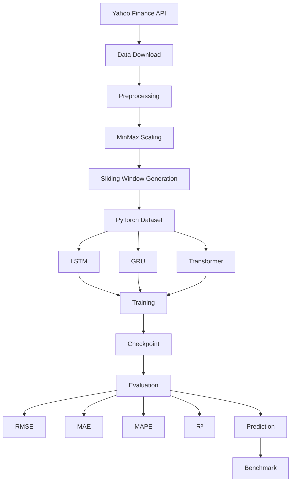

```mermaid
flowchart TD

A[Yahoo Finance API] --> B[Data Download]

B --> C[Preprocessing]

C --> D[MinMax Scaling]

D --> E[Sliding Window Generation]

E --> F[PyTorch Dataset]

F --> G[LSTM]

F --> H[GRU]

F --> I[Transformer]

G --> J[Training]

H --> J

I --> J

J --> K[Checkpoint]

K --> L[Evaluation]

L --> M[RMSE]

L --> N[MAE]

L --> O[MAPE]

L --> P[R²]

L --> Q[Prediction]

Q --> R[Benchmark]
```
